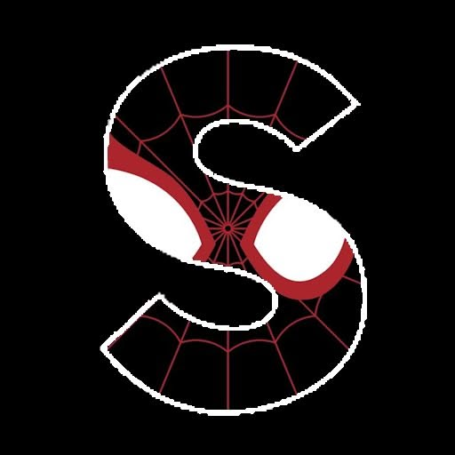
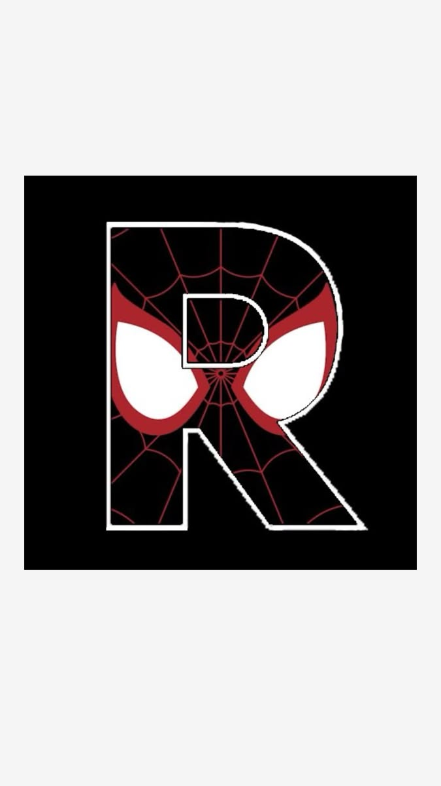
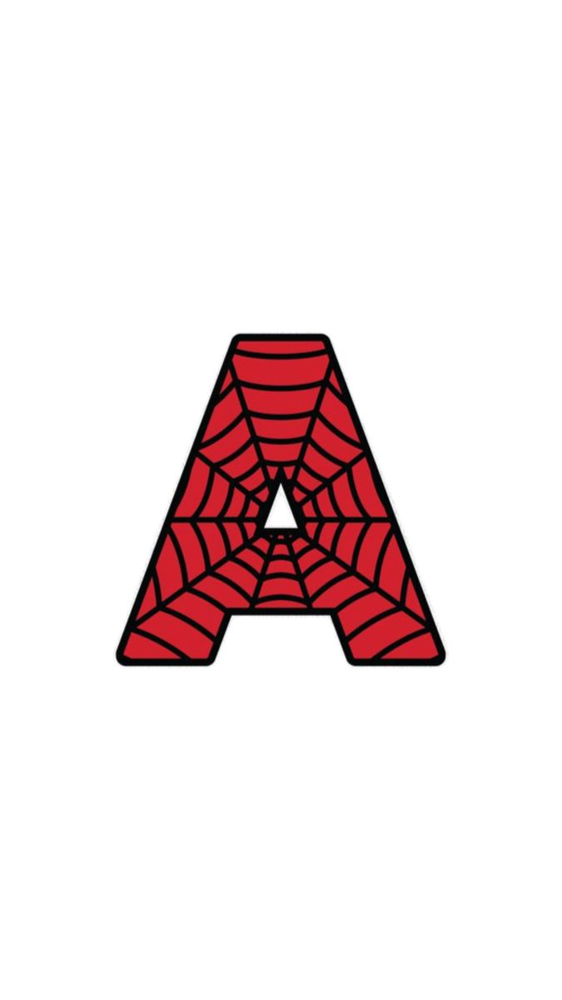
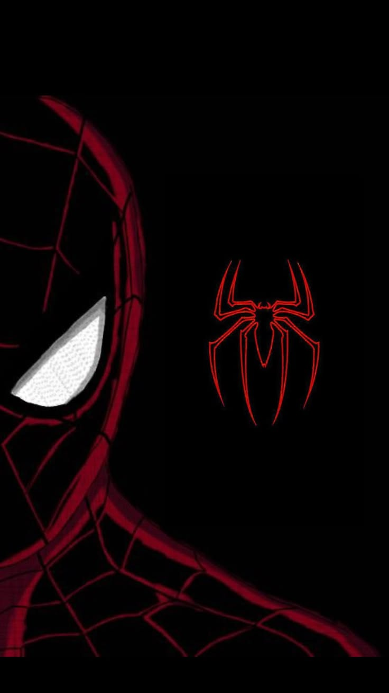
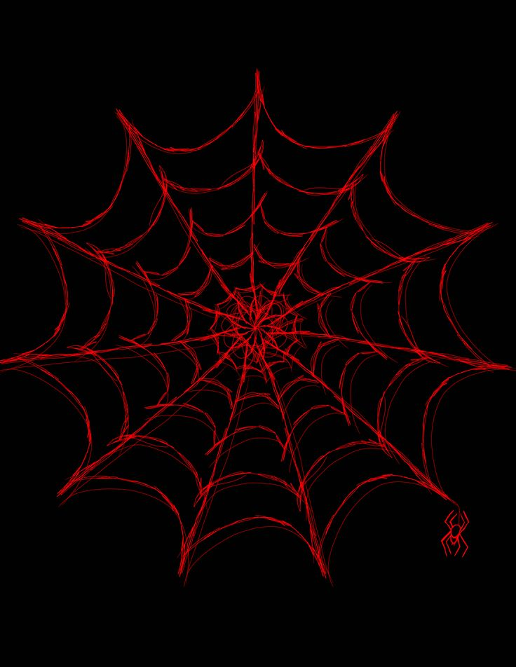
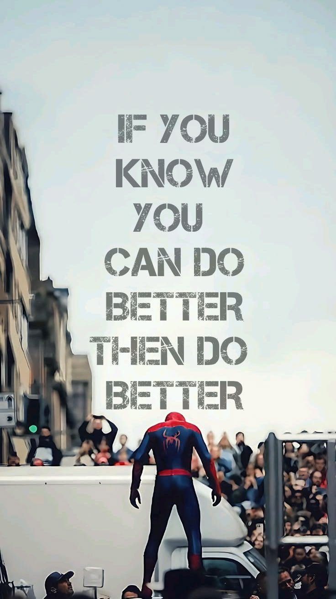
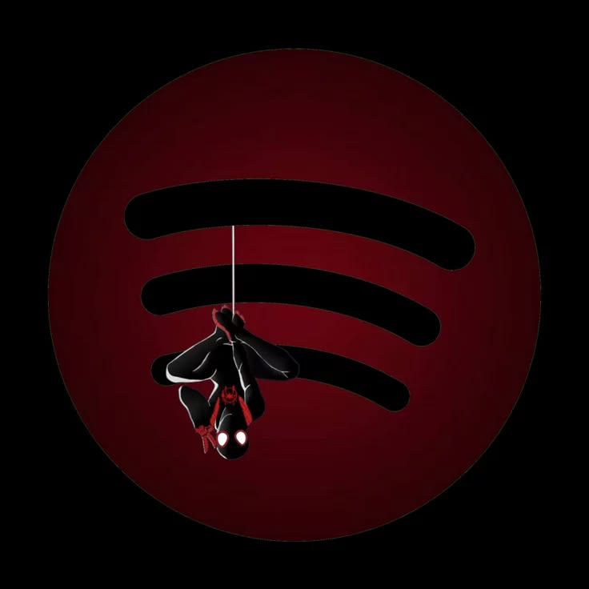
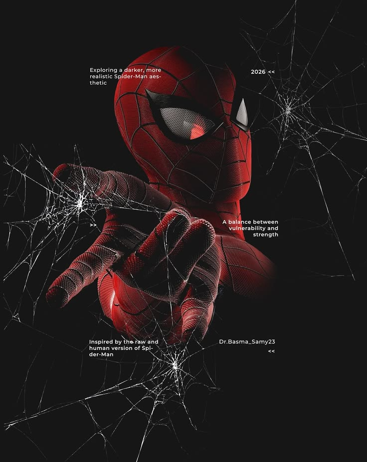

<!-- ═══════════ 🕸️ SPIDER-VERSE EDITION • SURAJ KUMAR 🕸️ ═══════════ -->

<div align="center">

<!-- ░░ 01 · ANIMATED NAME REVEAL ░░ -->


<!-- ░░ 02 · SPIDEY LETTER MONOGRAM (web-textured name letters) ░░ -->




<br/>

<!-- ░░ 03 · LIVE TYPING ANIMATION ░░ -->
<a href="https://github.com/Suraj8619">

</a>

<br/>

<!-- ░░ 04 · SPIDER SIGNAL GIF ░░ -->


<br/><br/>


</div>


<!-- ═══════════ ORIGIN STORY ═══════════ -->
<h2 align="center">🕷️ <code>ORIGIN&nbsp;STORY</code> 🕷️</h2>



```diff
+ NAME    : Suraj Kumar
+ ALIAS   : The Full-Stack Web-Slinger
+ BASE    : Bhagalpur, India
! MISSION : Ship fast, secure, scalable web experiences
```

> One radioactive commit changed everything.
>
> I'm **Suraj Kumar** — a **Full-Stack Developer** swinging between
> **React · Next.js · Node · Express · MongoDB · SQL**, spinning scalable
> products out of clean, resilient code.
>
> Spider-sense tuned to **DSA, OOPS, DBMS, OS and Networks**; webs made of
> **secure REST APIs, auth systems, microservices** and buttery responsive UIs.
>
> I don't just fix bugs — I web them up, hang them from a lamppost, and ship
> the patch before the city wakes up. 🕸️

<br clear="right"/>

<div align="center">

> ### 🕸️ _"When you can do the things that I can, but you don't... and then the bad things happen, they happen because of you."_

</div>


<!-- ═══════════ POWERS ═══════════ -->
<h2 align="center">⚡ <code>SUIT&nbsp;TECH&nbsp;&&nbsp;SUPERPOWERS</code> ⚡</h2>

<div align="center">


**🔴 LANGUAGES**


**🕸️ FRAMEWORKS & UI**


**☁️ CLOUD & DATABASES**


**🛠️ WEB-SHOOTER TOOLKIT**


<br/>


</div>


<!-- ═══════════ FIELD MISSIONS ═══════════ -->
<h2 align="center">🦸 <code>FIELD&nbsp;MISSIONS</code> 🦸</h2>



### `AI ALLY` — Frontend Web & AI Developer Intern
**Jun 2025 → Oct 2025 · Remote**

- 🕸️ Spun **15+ reusable React components** into a responsive, battle-tested UI architecture.
- 🧠 Wired **5+ Azure AI capabilities** into frontend workflows for genuinely intelligent interactions.
- 🚀 Delivered **3+ production modules** end-to-end inside an Agile strike team.

<br clear="left"/>

<div align="center">

> ### 🔴 _"No plan B. I'll make this happen."_


</div>


<!-- ═══════════ TRAINING GROUND ═══════════ -->
<h2 align="center">🎓 <code>TRAINING&nbsp;GROUND</code> 🎓</h2>

<div align="center">

| 🕷️ | INSTITUTION | DETAILS | SCORE |
|:--:|:--|:--|:--:|
| 🎓 | **IIIT Bhagalpur** · 2023–2027 | B.Tech, Electronics & Communication Engg. | **8.15 / 10** |
| 🏫 | **S.L. DAV Public School (CBSE)** | Class XII · 2022 | **91.6%** |
| 🏫 | **S.L. DAV Public School (CBSE)** | Class X · 2020 | **96.6%** |



> ### ⚫ _"If you know you can do better — then do better."_

</div>


<!-- ═══════════ HALL OF HEROICS ═══════════ -->
<h2 align="center">🏆 <code>HALL&nbsp;OF&nbsp;HEROICS</code> 🏆</h2>


```yaml
achievements:
  - "🕸️ 500+ DSA problems webbed across LeetCode, CodeChef & GeeksforGeeks"
  - "⚡ Peak LeetCode rating: 1750 in competitive contests"
  - "🧑‍🏫 Coding Mentor @ PYC Technical Club — training the next spider-squad"
  - "🎪 Organised hackathons & contests with 400+ participants"
  - "🤼 Kabaddi Sports Secretary @ IIIT Bhagalpur"
```

<br clear="right"/>

<div align="center">


</div>


<!-- ═══════════ WEB ACTIVITY ═══════════ -->
<h2 align="center">📊 <code>WEB&nbsp;ACTIVITY&nbsp;MONITOR</code> 📊</h2>

<div align="center">


</div>


<!-- ═══════════ WEB CRAWLER ═══════════ -->
<h2 align="center">🕷️ <code>THE&nbsp;WEB&nbsp;CRAWLER&nbsp;EATS&nbsp;MY&nbsp;COMMITS</code> 🕷️</h2>

<div align="center">


</div>


<!-- ═══════════ OFF-DUTY ═══════════ -->
<h2 align="center">🎧 <code>OFF-DUTY&nbsp;MODE</code> 🎧</h2>

<div align="center">


&nbsp;&nbsp;&nbsp;


_Code in one ear, lo-fi in the other. The city stays quiet either way._

<!-- Pinterest animation you asked for — GitHub strips <iframe>, so it's a live link instead -->
<a href="https://www.pinterest.com/pin/1120059369847857564/">

</a>

</div>


<!-- ═══════════ SIGNAL ═══════════ -->
<h2 align="center">📡 <code>SEND&nbsp;THE&nbsp;SIGNAL</code> 📡</h2>

<div align="center">



<br/><br/>

<a href="https://github.com/Suraj8619"></a>
<a href="https://www.linkedin.com/in/suraj-kumar-234173343/"></a>
<a href="https://leetcode.com/u/SurajK_1234/"></a>
<a href="mailto:suraj.chvcngf@gmail.com"></a>
<br/>


<br/><br/>

### 🕸️ _"With great power comes great responsibility... and clean, well-documented code."_


</div>
